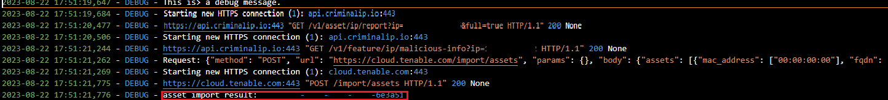
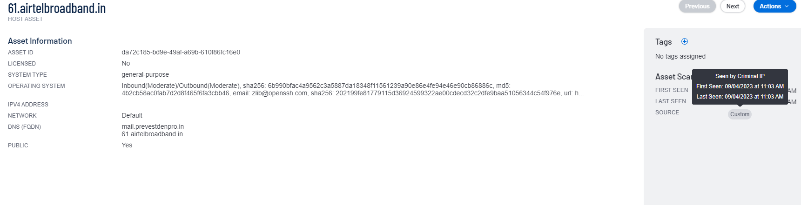
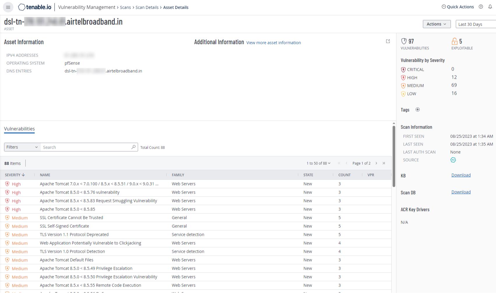

# **Criminal IP to Tenable.io Integration**

# 1. About
This project facilitates the transfer of basic information about IP addresses detected by Criminal IP to  [tenable.io](https://www.tenable.io/). Subsequently, tenable.io performs direct scans to gather more detailed information about these IPs. This integration allows for a more in-depth analysis of the suspicious content identified by Criminal IP.

# 2. Components Used
## Criminal IP
- 'GET /v1/asset/ip/report'
- 'GET /v1/feature/ip/malicious-info'

## Tenable.io
- 'POST Import assets'
- 'GET import job information'

## Screens
### Data Import to Tenable

When you import data from Criminal IP into Tenable, you can verify the asset import result in the returned value, similar to the red-marked section.



This UUID value can be used to check whether the data has been successfully uploaded to Tenable.io.

- Some Results from the Tenable.io Dashboard

   

### Tenable.io Scan Results
Scanned result values ​​that can be checked on the scanner




# 3. Install 
```shell
pip install pytenable
```

download file command
```shell
git clone https://github.com/criminalip/CriminalIP-Tenable-Import-Asset.git
```

# 2. Description

**File Structure**
- `config.py`: Configuration file for API keys and constants.
- `main`: Main execution file.
- `ip_list`: File for inputting multiple IP addresses.
- `core/cip_requests`: File for fetching information to be parsed from Criminal IP.
- `core/tenable_asset_import`: File for importing Criminal IP information into Tenable.
- `core/process/data_parsing`: File for parsing data that can be obtained from Criminal IP.
- `core/process/process_ip_data`: File that defines the overall program flow.


# 3. Usage
Verify that the IP address you want to investigate is listed in the "ip.txt" file. If it's not present, you can add the desired IP to the "ip.txt" file.

### api_key setting
---
Set the "CRIMINAL_API_KEY" with your Criminal IP API_KEY issued from https://www.criminalip.io/mypage/information
```python
CRIMINALIP_API_KEY = '${CRIMINALIP_API_KEY}'
```
Set the "ACCESS_KEY" and "SECRET_KEY" with your Tenable.io API keys. The tenable API_KEY can be checked by pressing the generate button in [Tenable.io / Settings / My Account](https://cloud.tenable.com/tio/app.html#/login)..
```python
ACCESS_KEY = '${Tenable_ACCESS_API_KEY}'
SECRET_KEY = '${Tenable_SECRET_API_KEY}'
```


### excution python file
---
We will be importing the data in Bulk For Multiple/Bulk IPs:

To use the command below, enter the IPs you want to include in Tenable in the ip_list.txt file in advance.

```shell
python main.py bulk --file <file_path>
```


### running video


# 4. Error Code
Below are the descriptions for each error code
--
    - "Your CriminalIP API key is invalid": This error occurs when the API key is entered incorrectly.
    - "An unexpected error occurred": This error occurs when the CIP API server has failed. If you receive this error code, please try again later, or contact us at support@aispera.com.
    - "The target must be an IP address": This error occurs when you enter an incorrect argument value instead of providing an IP address in the target variable.
    - "Unable to call api at the same time": This error occurs when you are not an Enterprise plan user and attempt to make concurrent API calls, which is restricted.